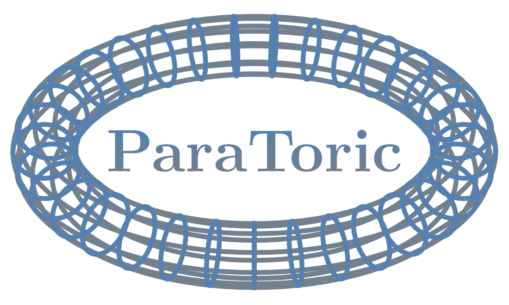

ParaToric
=========

ParaToric is a C++ package that implements a continuous-time quantum Monte Carlo algorithm for the toric code in a parallel field (aka the extended/perturbed toric code)
```math
\hat{\mathcal{H}}_{\mathrm{eTC}} = \underbrace{- \mu \sum_+ \prod_{l \in +} \hat{\sigma}_l^x \; - J \sum_{\square} \prod_{l \in \square} \hat{\sigma}_l^z}_{\text{toric code } (\text{square lattice, } \mu=J=1)} \; \underbrace{- h \sum_{l} \hat{\sigma}_l^x \; - \lambda \sum_{l} \hat{\sigma}_l^z}_{\text{external fields}},
```
where $`J, \lambda \geq 0`$ in the $`\hat{\sigma}^x`$-basis and $`\mu, h \geq 0`$ in the $`\hat{\sigma}^z`$-basis. The temperature $`T=1 / \beta`$ is finite. The algorithm is based on [Wu <em>et al.</em>, Phys. Rev. B <strong>85</strong>, 195104 (2012)][1]. We implement many lattice geometries, see [Usage](#usage).

If you use ParaToric for a publication, please cite [
https://doi.org/10.48550/arXiv.2510.14781][10].

Contents
--------

* [Dependencies](#dependencies)
* [Quickstart](#quickstart)
* [Usage](#usage)
  - [$`T`$-sweep](#T-sweep)
  - [h-sweep](#h-sweep)
  - [$`\lambda`$-sweep](#lambda-sweep)
  - [$`\circ`$-sweep](#circ-sweep)
  - [Thermalization](#thermalization)

Dependencies
------------

We require a C++ compiler (tested with GCC 15 and Clang 20) with C++23 support. Our implementation further requires the [Boost][3] (1.87 and above) and [HDF5][9] (1.14.3 and above) libraries. Refer to their website for installation instructions. 

If you intend to use our Python scripts, you will need [NumPy][4], [matplotlib][5] and [h5py][6].

Quickstart (CLI)
----------------

To compile this project, run the following command:

```bash
$ cmake -S . -B build -DCMAKE_BUILD_TYPE=Release -DPARATORIC_ENABLE_NATIVE_OPT=ON -DPARATORIC_LINK_MPI=ON -DPARATORIC_BUILD_CLI=ON
$ cmake --build build -jN
$ ctest --test-dir build -jN --output-on-failure
$ cmake --install build 
```

Replace `N` with the number of cores you want to use, e.g. `-j4` for 4 cores. 

By default, the executables will be installed in `${CMAKE_SOURCE_DIR}/${CMAKE_INSTALL_BINDIR}/`, the header files in `${CMAKE_INSTALL_INCLUDEDIR}/paratoric` and the static libraries in `${CMAKE_SOURCE_DIR}/${CMAKE_INSTALL_LIBDIR}/`. By default,  `CMAKE_INSTALL_PREFIX = CMAKE_SOURCE_DIR`, since on a computing cluster users may not have privileges to install software into the usual Linux/Unix folders. The Python scripts that come with this package expect `${CMAKE_SOURCE_DIR}/bin/`, this directory always contains the executable `paratoric` in any case. If you want to install paratoric into a custom directory, pass this directory to CMake using the `-DCMAKE_INSTALL_PREFIX` flag. E.g., if you wanted to install into `/usr/local/`, you would use `cmake -DCMAKE_INSTALL_PREFIX=/usr/local/ ..` instead of `cmake ..`. 

Usage (Python CLI)
------------------

There are five ways to use ParaToric. We provide bindings to C/C++/Python and command line interfaces for C++/Python, see [documentation](doc/Documentation.pdf). Here we only briefly present the Python command line interface.

A [Jupyter notebook](scripts/bash_creator.ipynb) for creating [SLURM][2] jobscripts is provided.

**General Python command line options**

| Long flag                    | Short     | Description                                                                        |
|:-----------------------------|:---------:|:-----------------------------------------------------------------------------------|
| `--help`                     |  `-h`     | Display help message (lists command line arguments)                                |
| `--simulation`               | `-sim`    | Simulation type                                                                    |
| `--N_thermalization`         | `-Nth`    | Number of thermalization steps (i.e. proposed updates)                             |
| `--N_samples`                | `-Ns`     | Number of samples                                                                  |
| `--N_between_steps`          | `-Nbs`    | Number of steps between samples                                                    |
| `--N_resamples`              | `-Nr`     | Number of bootstrap resamples                                                      |
| `--custom_therm`             | `-cth`    | Whether thermalization values of $`h`$ and $`\lambda`$ should be used (`0` or `1`) |
| `--observables`              | `-obs`    | List of observables, e.g. `fredenhagen_marcu percolation_probability energy`       |
| `--seed`                     | `-seed`   | Seed for the pseudorandom number generator. `0` means random seed                  |
| `--mu_constant`              | `-muc`    | Value of $`\mu`$                                                                   |
| `--J_constant`               | `-Jc`     | Value of $`J`$                                                                     |
| `--h_constant`               | `-hc`     | Value of $`h`$                                                                     |
| `--h_constant_therm`         | `-hct`    | Thermalization value of $`h`$                                                      |
| `--lmbda_constant`           | `-lmbdac` | Value of $`\lambda`$                                                               |
| `--lmbda_constant_therm`     | `-lmbdact`| Thermalization value of $`\lambda`$                                                |
| `--output_directory`         | `-outdir` | Output directory                                                                   |
| `--snapshots`                | `-snap`   | Whether snapshots should be saved to output directory (`0` or `1`)                 |
| `--full_time_series`         | `-fts`    | Whether full counting statistics should be saved to output directory (`0` or `1`)  |
| `--processes`                | `-proc`   | Number of (logical) CPU cores for Python multiprocessing                           |

**Lattice specific Python command line options**

| Long flag                       | Short     | Description                                                                          |
|:--------------------------------|:---------:|:-------------------------------------------------------------------------------------|
| `--help`                        |  `-h`     | Display help message (lists command line arguments)                                  |
| `--basis`                       | `-bas`    | Spin basis (`x`, `z`)                                                                |
| `--lattice_type`                | `-lat`    | Lattice type (e.g. `square`, `cubic`, `triangular`, `honeycomb`, ...)                |
| `--system_size`                 | `-L`      | System size (`20` will result in $`20 \times 20`$ lattice in 2D)                     |
| `--temperature`                 | `-T`      | Temperature $`T=1 / \beta > 0`$                                                      |
| `--boundaries`                  | `-bound`  | Boundary conditions (`periodic` or `open`)                                           |
| `--default_spin`                | `-dsp`    | Default initialization value of spin on edges (`1` or `-1`)                          |

It is relatively easy to define your own lattices/boundary conditions by adapting the code. Observables may have to be adapted, too! This is especially relevant for all percolation observables and Wilson/'t Hooft loops. Make sure to write appropriate test cases.

### $`T`$-sweep

This simulation type runs `T_steps` individual Markov chains for evenly spaced temperatures in the interval `T_lower` $`\leq T \leq`$ `T_upper`. It calculates and plots `observables` for all temperatures. As this task is trivial to parallelize, we advise matching `processes` = `T_steps` as closely as possible for optimal runtime.

An exemplary simulation could look like this:
```bash
$ python3 ./python/cli/paratoric.py -sim etc_T_sweep -Ns 1000 -muc 1 -Nth 2000 -Nbs 100 -Tl 0.5 -Tu 5 -Ts 30 -hc 0.1 -Jc 1 -lmbdac 0.1 -Nr 1000 -obs percolation_strength percolation_probability plaquette_percolation_probability largest_cluster string_number energy energy_h energy_mu energy_J energy_lmbda sigma_x sigma_z star_x plaquette_z staggered_imaginary_times delta anyon_count anyon_density fredenhagen_marcu sigma_x_susceptibility sigma_z_susceptibility -s 0 -bas x -lat square -L 4 -bound periodic -dsp 1 -outdir /your/output/directory 
```

**Specific Python Command line options**

| Long flag           | Short      | Description                                                         |
|:--------------------|:----------:|:--------------------------------------------------------------------|
| `--help`            |  `-h`      | Display help message (lists command line arguments)                 |
| `--simulation`      | `-sim`     | Simulation type (here `etc_T_sweep`)                                |
| `--T_lower`         | `-Tl`      | Lower bound of temperature $`T`$                                    |
| `--T_upper`         | `-Tu`      | Upper bound of temperature $`T`$                                    |
| `--T_steps`         | `-Ts`      | Number of temperature steps between lower and upper bound           |

### h-sweep

This simulation type runs `h_steps` individual Markov chains for evenly spaced fields in the interval `h_lower` $`\leq h \leq`$ `h_upper`. It calculates and plots `observables` for all fields. As this task is trivial to parallelize, we advise matching `processes` = `h_steps` as closely as possible for optimal runtime.

An exemplary simulation could look like this:
```bash
$ python3 ./python/cli/paratoric.py -sim etc_h_sweep -Ns 1000 -muc 1 -Nth 2000 -Nbs 100 -hl 0.1 -hu 0.5 -hs 8 -T 0.03 -Jc 1 -lmbdac 0.2 -Nr 1000 -obs percolation_strength percolation_probability plaquette_percolation_probability largest_cluster string_number energy energy_h energy_mu energy_J energy_lmbda sigma_x sigma_z star_x plaquette_z staggered_imaginary_times delta anyon_count anyon_density fredenhagen_marcu sigma_x_susceptibility sigma_z_susceptibility -s 0 -bas x -lat square -L 6 -bound periodic -dsp 1 -outdir /your/output/directory 
```

**Specific Python Command line options**

| Long flag           | Short      | Description                                                         |
|:--------------------|:----------:|:--------------------------------------------------------------------|
| `--help`            |  `-h`      | Display help message (lists command line arguments)                 |
| `--simulation`      | `-sim`     | Simulation type (here `etc_h_sweep`)                                |
| `--h_lower`         | `-hl`      | Lower bound of field $`h`$                                          |
| `--h_upper`         | `-hu`      | Upper bound of field $`h`$                                          |
| `--h_steps`         | `-hs`      | Number of field steps between lower and upper bound                 |

### $`\lambda`$-sweep

This simulation type runs `lmbda_steps` individual Markov chains for evenly spaced fields in the interval `lmbda_lower` $`\leq \lambda \leq`$ `lmbda_upper`. It calculates and plots `observables` for all fields. As this task is trivial to parallelize, we advise matching `processes` = `lmbda_steps` as closely as possible for optimal runtime.

An exemplary simulation could look like this:
```bash
$ python3 ./python/cli/paratoric.py -sim etc_lmbda_sweep -Ns 1000 -muc 1 -Nth 2000 -Nbs 100 -lmbdal 0.01 -lmbdau 1.0 -lmbdas 15 -T 0.1 -hc 0.3  -Jc 1 -Nr 1000 -obs percolation_strength percolation_probability plaquette_percolation_probability largest_cluster string_number energy energy_h energy_mu energy_J energy_lmbda sigma_x sigma_z star_x plaquette_z staggered_imaginary_times delta anyon_count anyon_density fredenhagen_marcu sigma_x_susceptibility sigma_z_susceptibility -s 0 -bas x -lat square -L 4 -bound periodic -dsp 1 -outdir /your/output/directory 
```

**Specific Python Command line options**

| Long flag           | Short      | Description                                                         |
|:--------------------|:----------:|:--------------------------------------------------------------------|
| `--help`            |  `-h`      | Display help message (lists command line arguments)                 |
| `--simulation`      | `-sim`     | Simulation type (here `etc_lmbda_sweep`)                            |
| `--lmbda_lower`     | `-lmbdal`  | Lower bound of field $`\lambda`$                                    |
| `--lmbda_upper`     | `-lmbdau`  | Upper bound of field $`\lambda`$                                    |
| `--lmbda_steps`     | `-lmbdas`  | Number of field steps between lower and upper bound                 |

### $`\circ`$-sweep

This simulation type runs `Theta_steps` individual Markov chains on a circle in $`\lambda-h`$ space with center `(lmbda_constant, h_constant)`and radius `radius` for evenly spaced angles in the interval `Theta_lower` $`\leq \Theta \leq`$ `Theta_upper`. Angles are measured anti-clockwise relative to the $`\lambda`$-axis. It calculates and plots `observables` for all angles. As this task is trivial to parallelize, we advise matching `processes` = `Theta_steps` as closely as possible for optimal runtime.

An exemplary simulation could look like this:
```bash
$ python3 ./python/cli/paratoric.py -sim etc_circle_sweep -Ns 1000 -muc 1 -Nth 2000 -Nbs 100 -lmbdac 0.4 -rad 0.3 -Thl 0 -Thu 3.141 -Ths 15 -T 0.1 -hc 0.4 -Jc 1 -Nr 1000 -obs percolation_strength percolation_probability plaquette_percolation_probability largest_cluster string_number energy energy_h energy_mu energy_J energy_lmbda sigma_x sigma_z star_x plaquette_z staggered_imaginary_times delta anyon_count anyon_density fredenhagen_marcu sigma_x_susceptibility sigma_z_susceptibility -s 0 -bas x -lat square -L 4 -bound periodic -dsp 1 -outdir /your/output/directory 
```

**Specific Python Command line options**

| Long flag           | Short      | Description                                                         |
|:--------------------|:----------:|:--------------------------------------------------------------------|
| `--help`            |  `-h`      | Display help message (lists command line arguments)                 |
| `--simulation`      | `-sim`     | Simulation type (here `etc_circle_sweep`)                           |
| `--lmbda_constant`  | `-lmbdac`  | Center of the circle ($`\lambda`$)                                  |
| `--h_constant`      | `-hc`      | Center of the circle ($`h`$)                                        |
| `--radius`          | `-rad`     | Radius of the circle                                                |
| `--Theta_lower`     | `-Thl`     | Lower bound of angle $`\Theta`$                                     |
| `--Theta_upper`     | `-Thu`     | Upper bound of angle $`\Theta`$                                     |
| `--Theta_steps`     | `-Ths`     | Number of angle steps between lower and upper bound                 |

### Thermalization

This simulation type performs the thermalization for `repetitions` individual Markov chains. It calculates and plots `observables` as well as the Monte Carlo acceptance ratio after every Monte Carlo step, averaged over `repetitions`. As this task is trivial to parallelize, we advise matching `processes` = `repetitions` as closely as possible for optimal runtime.

An exemplary simulation could look like this:
```bash
$ python3 ./python/cli/paratoric.py -sim etc_thermalization -muc 1 -Nth 2000 -reps 10 -lmbdac 2 -T 0.1 -hc 0.3 -Jc 1 -Nr 1000 -obs percolation_strength percolation_probability plaquette_percolation_probability largest_cluster string_number energy energy_h energy_mu energy_J energy_lmbda sigma_x sigma_z star_x plaquette_z staggered_imaginary_times delta anyon_count anyon_density fredenhagen_marcu sigma_x_susceptibility sigma_z_susceptibility -s 0 -bas x -lat square -L 4 -bound periodic -dsp 1 -outdir /your/output/directory 
```

**Specific Python Command line options**

| Long flag           | Short      | Description                                                         |
|:--------------------|:----------:|:--------------------------------------------------------------------|
| `--help`            |  `-h`      | Display help message (lists command line arguments)                 |
| `--simulation`      | `-sim`     | Simulation type (here `etc_thermalization`)                         |
| `--repetitions`     | `-reps`    | Number of Markov chains to average over                             |

[1]: https://doi.org/10.1103/PhysRevB.85.195104
[2]: https://slurm.schedmd.com/
[3]: https://www.boost.org/
[4]: https://numpy.org/
[5]: https://matplotlib.org/
[6]: https://www.h5py.org/
[7]: https://ctan.org/pkg/amsmath
[8]: https://ctan.org/pkg/lm
[9]: https://www.hdfgroup.org/solutions/hdf5/
[10]: https://doi.org/10.48550/arXiv.2510.14781